# Дипломный практикум в Yandex.Cloud

## Этапы выполнения 
### Создание облачной инфраструктуры

1. Код реализующий поставленную задачу находится в директории ./terraform/bucket 

для запуска необходим файл terraform.auto.tfvars следующего содержимого:
```
token = ""
cloud_id  = ""
folder_id = ""
default_zone = "ru-central1-a"
bucket_name = "test-bucket-diplom"
```

Выполняется стандартным набором команд:

```
terraform init
terraform apply
terraform destroy
```

По результатам создаются: 
- Сервисный аккаунт для доступа
- S3 bucket для хранения стейта
- Registry для хранения собранных образов (в последствии отказался в пользу DockerHub)

Результат выполнения:
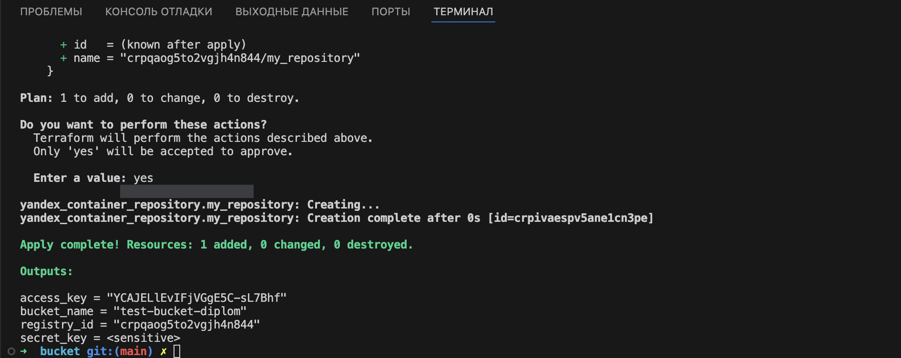
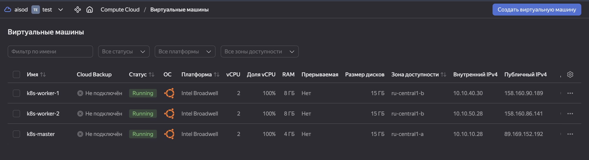
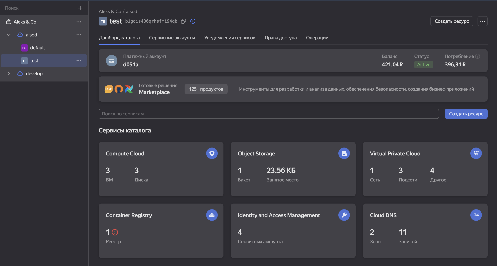

---
### Создание Kubernetes кластера
Код реализующий поставленную задачу находится в директории ./terraform/vms Код реализующий настройку сети и запуск виртуальных машин реализон через terraform. 
По результатам выполнения создается файл inventory.ini, который используется в дальнейшем для настройки кластера K8S. 
Запуск инициируется стандартным набором команд:

```
terraform init
terraform apply
terraform destroy
```

Установка K8S реализована через Kubespray.  Все этапы запуска (скачивание Kubespray репозитория, установка необходимой версии ansible, python, зависимостей, копирование inventory.ini и прочих конфигурационных файлов) автоматизированы через запуск скрипта ./terraform/vms/deploy_k8s.sh

Запуск:

```
chmod +x deploy_k8s.sh
sh deploy_k8s.sh
```

По результатам выполнения запускается ansible скрипт Kubespray который настраивает указанные в inventory.ini хосты.
Для удаленного подключения необходимо скопировать с ноды кластера k8s конфиг для подключения:

```
scp ubuntu@IP_MASTER_K8S:/etc/kubernetes/admin.conf ./kube.conf
```

в последующем к кластеру подключаюсь через этот файл командами вида:

```
kubectl --kubeconfig=./kube.conf get pods --all-namespaces
```

Результат выполнения:
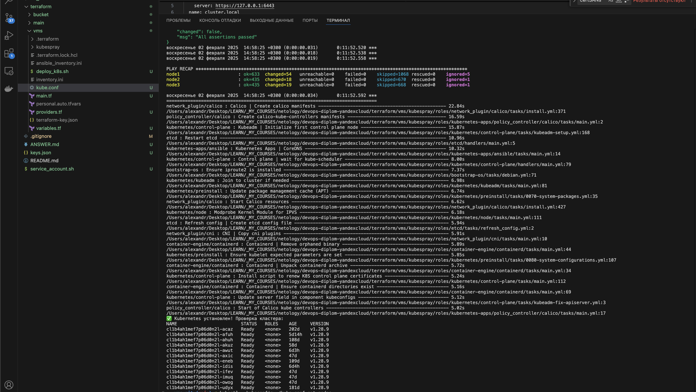
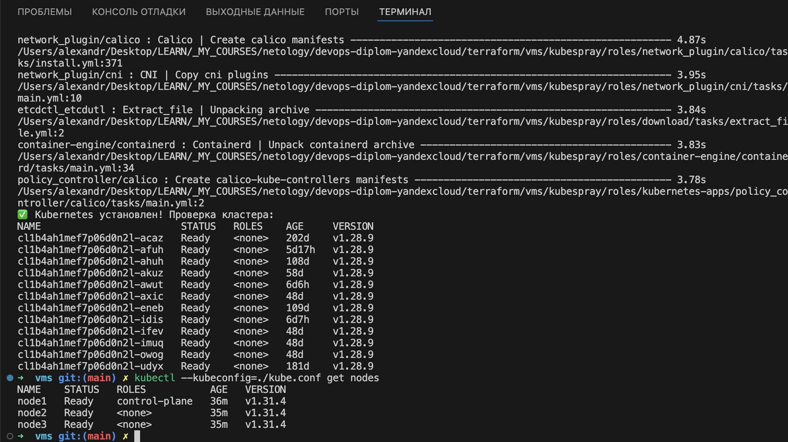

---
### Создание тестового приложения

Было принято решение разместить приложение в открытом репозитории DockerHub (https://hub.docker.com/r/d051a/my-app-nginx)


Само тестовое приложение расположено в директории ./test-app Предварительная сборка, публикация приложения и скачивание образа из Registry DockerHub осуществляется через следующие команды:

```
docker build --platform linux/amd64 -t d051a/my-app-nginx:1.0.0 .
docker push d051a/my-app-nginx:3.0.0

docker pull d051a/my-app-nginx:3.0.0
```

Результат выполнения:
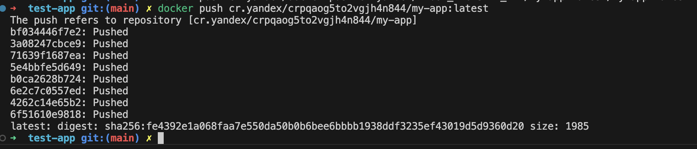
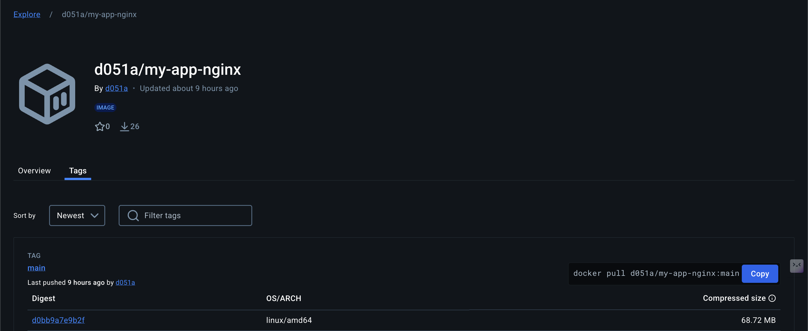


---
### Подготовка cистемы мониторинга и деплой приложения
Для реализации задачи было выбрано решение установки мониторинга через helm-charts

Для начала установил `helm` на `control-plane` ноду
```
curl https://raw.githubusercontent.com/helm/helm/master/scripts/get-helm-3 | bash
```
Создал отдельное простанство имен для мониторинга
```
kubectl create namespace monitoring
```
Добавил репозиторий `helm` c `prometheus`
```
helm repo add prometheus-community https://prometheus-community.github.io/helm-charts
```
Устанавил `kube-prometheus-stack` (установка `Prometheus`, `Grafana`, `Alertmanager`, `node-exporter` и `kube-state-metrics`)
```
helm install prometheus prometheus-community/kube-prometheus-stack -n monitoring
```
```
kubectl get pods -n monitoring
```

Далее, получил пароль от `Grafana`
```
kubectl get secret -n monitoring prometheus-grafana -o jsonpath="{.data.admin-password}" | base64 --decode ; echo
```
Настроил доступ к `Grafana` по внешнему ip адресу, для чего создал файл values.yml
```yml
grafana:
  service:
    type: NodePort
    nodePort: 32000 
```
```
helm upgrade prometheus prometheus-community/kube-prometheus-stack -n monitoring -f values.yml
```

Далее настраиваем необходимые метрики из стандартного шаблона `Grafana` - [ID 315](https://grafana.com/grafana/dashboards/315-kubernetes-cluster-monitoring-via-prometheus/)


Результат выполнения:
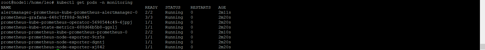
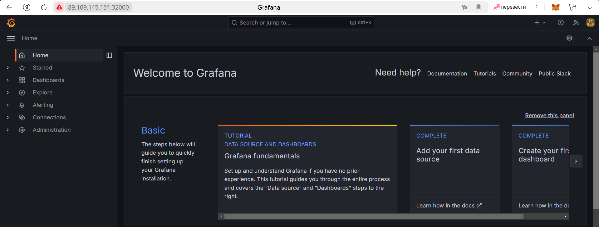
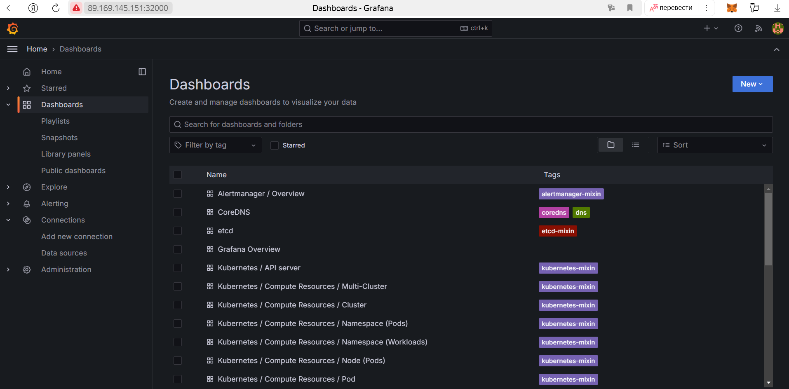
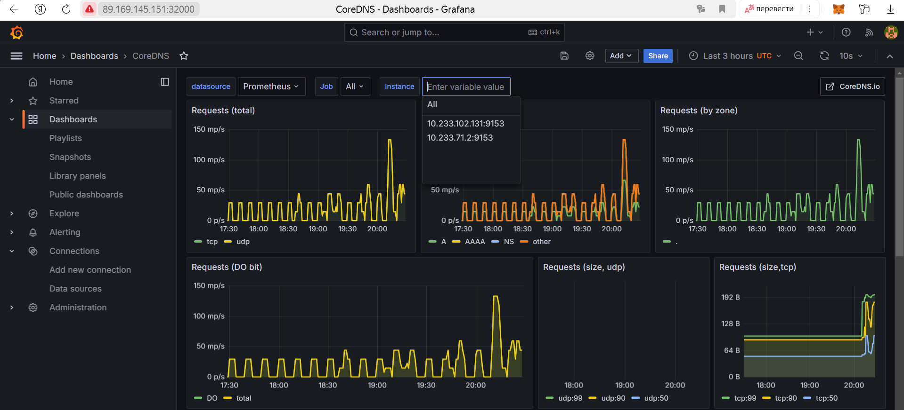


Само приложение было размещено в репозитории Gitlab (https://gitlab.com/d051a/netology_devops_course) Там же расположен код для деплоя приложения - файл deploy-k8s.yml. Код самого приложения и код для деплоя приложения продублирован в директории ./test-app в этом проекте. Также был зарегистрирован бесплатный домен netology.zapto.org

Для деплоя приложения в среду k8s выполняем команду:

```
kubectl apply --kubeconfig=./kube.conf -f deploy-k8s.yml
```

Результат выполнения:
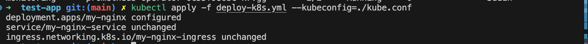
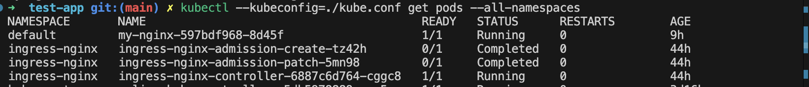
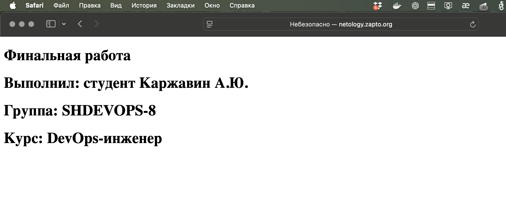

---
### Установка и настройка CI/CD

CD/CD реализовано на базе Gitlab-CI
Для реализации пайплайна в settings - cicd добавлены переменные для подключения к dockerHub и файл для подключения к кластеру k8s.

Пайплайн состоит из двух стадий: build и deploy

На этапе build идет сборка проекта и собранный образ сохраняется в dockerHub.

На этапе deploy выполняется разворачивание приложения из ранее созданного образа.

файл .gitlab-ci.yml расположен в директории ./test-app/ в этом проекте .gitlab-ci.yml , а также в репозитории проекта на GitLab (https://gitlab.com/d051a/netology_devops_course)


Результат выполнения:
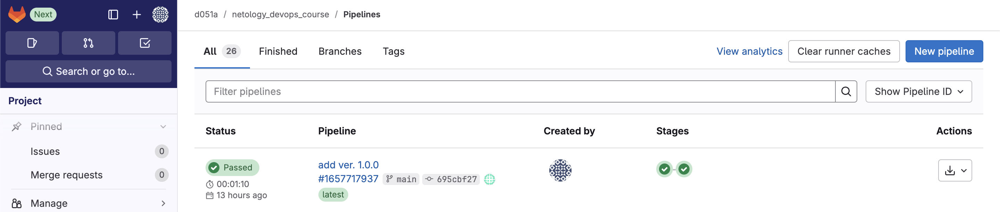
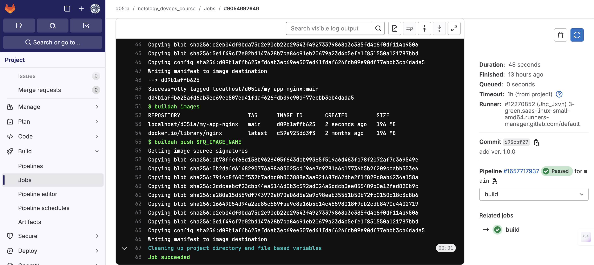
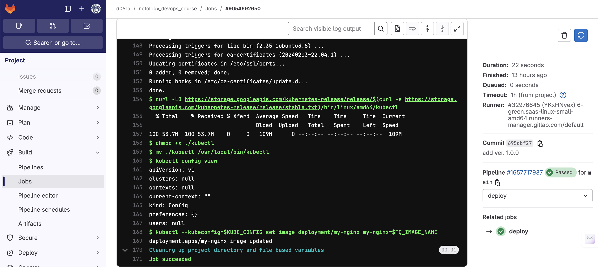

---
## Что необходимо для сдачи задания?

1. Репозиторий с конфигурационными файлами Terraform и готовность продемонстрировать создание всех ресурсов с нуля.
2. Пример pull request с комментариями созданными atlantis'ом или снимки экрана из Terraform Cloud или вашего CI-CD-terraform pipeline.
3. Репозиторий с конфигурацией ansible, если был выбран способ создания Kubernetes кластера при помощи ansible.
4. Репозиторий с Dockerfile тестового приложения и ссылка на собранный docker image.
5. Репозиторий с конфигурацией Kubernetes кластера.
6. Ссылка на тестовое приложение и веб интерфейс Grafana с данными доступа.
7. Все репозитории рекомендуется хранить на одном ресурсе (github, gitlab)

